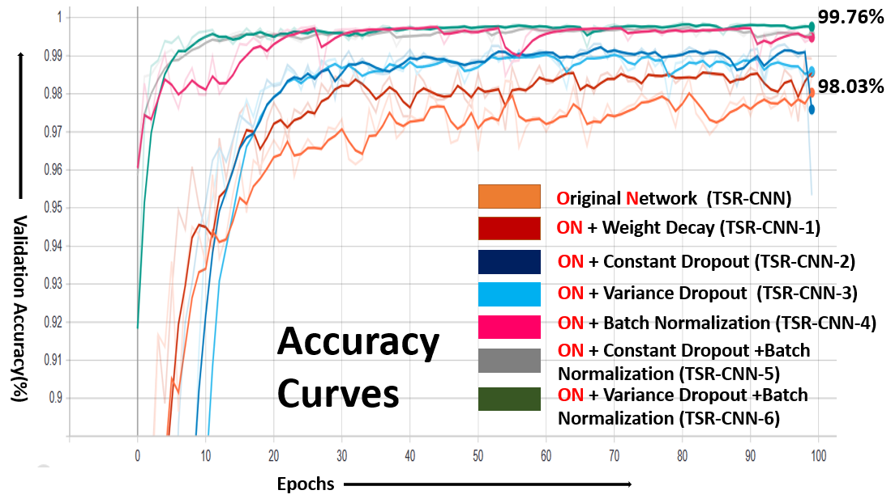
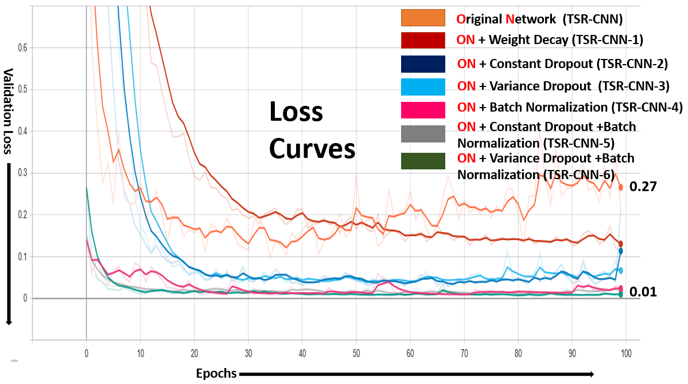

# German Traffic Sign Recognation Model
The model recognizes the different traffic-signs.
## Data-set to train the model
GTSRB Dataset dowload link : https://www.kaggle.com/meowmeowmeowmeowmeow/gtsrb-german-traffic-sign

## Features of the Google-Colab Files
- Automatic downloads the GTSRB Dataset
- Automatic Image Processing Done
- Total 6 differents models
- User can see, accuracy and loss curve at Tensorboard
- User can visulize the filters and features maps
- User can able to generate the confusion matrix
- Also able to save and load the models into three different formates
## How use the repository
- Open the **GTSRB_CNN.ipynb** file
- Then run all the cells, and choose one model outoff 7
- Finally, get the results 
## Experiment results
- Accuracy Graph from Tensorboard
  

- Loss Graph
  

